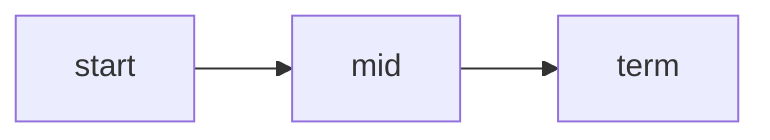
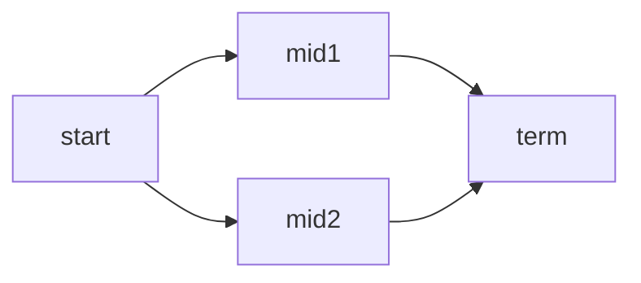
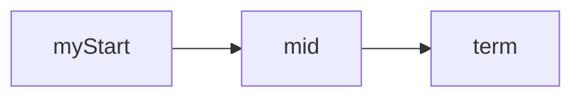
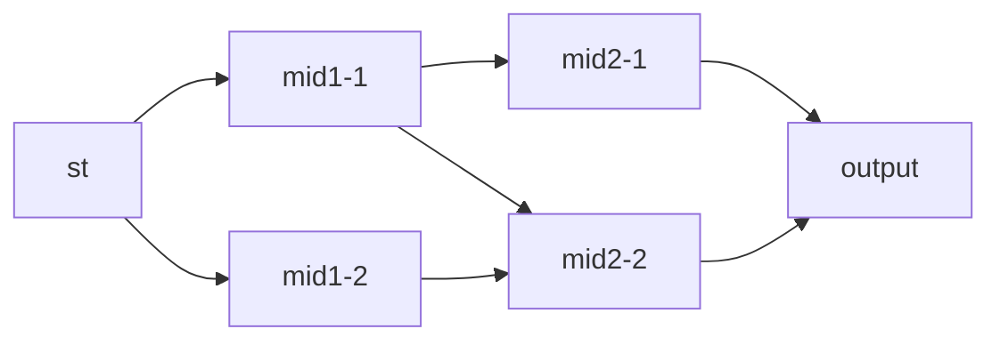
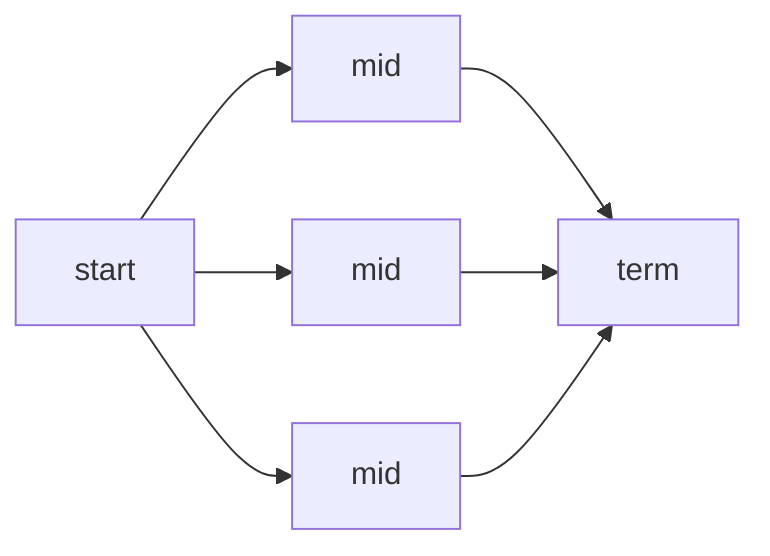

# Design document for graph composition API

For a future 1.0 version. Includes breaking changes with current API.

## Explicit modes

In explicit modes, each node has an explicit ID and destination node.

### Basic

```go
type MyGraph struct {
    Start StartNode `nodeId:"start" sendsTo:"mid"`
    Mid   MidNode   `nodeId:"mid" sendsTo:"term"`
    Term  TermNode  `nodeId:"term"`
}
```



### Basic, sending to multiple nodes

```go
type MyGraph struct {
    Start StartNode `nodeId:"start" sendsTo:"mid1,mid2"`
    Mid1   MidNode  `nodeId:"mid1" sendsTo:"term"`
    Mid2   MidNode  `nodeId:"mid2" sendsTo:"term"`
    Term  TermNode  `nodeId:"term"`
}
```




### Allow user configuring the node and destination IDs

```go
type StartNode struct {
    ID   string `nodeId` // marks value of this field as nodeId
    Dest string `sendsTo` // marks value of this field as destination node Id
}
type MyGraph struct {
    Start StartNode // we don't need to define neither nodeId nor sendsTo here
    Mid   MidNode   `nodeId:"mid" sendsTo:"term"`
    Term  TermNode  `nodeId:"term"`
}
```

E.g. for a configuration like:
```go
MyGraph {
    Start: StartNode {
        ID:      "myStart",
        SendsTo: "mid",
    },
}
```



This might be specially helpful for a free-form, user-defined graphs:

```go
type StartNode struct {
    ID   string `nodeId`
    Dest string `sendsTo`
}
type MidNode struct {
    ID   string `nodeId`
    Dest string `sendsTo`
}
type MyGraph struct {
    Start StartNode
    Mids  []MidNode
    Term  TermNode `nodeId:"output"`
}
```

E.g. A config like:

```go
MyGraph {
    Start: StartNode {
        ID: "st", Dest: "mid1-1,mid1-2",
    },
    Mids: []MidNode {
        { ID: "mid1-1", Dest:"mid2-1,mid2-2" },
        { ID: "mid1-2", Dest:"mid2-2" },
        { ID: "mid2-1", Dest:"output" },
        { ID: "mid2-2", Dest:"output" },
    },
}
```

would generate:



## Node auto-naming

### Sharing nodeId in array

A "nodeId" tagging an array of nodes makes all the nodes to share de ID.

E.g.:

```go
type MyGraph struct {
    Start StartNode `nodeId:"start" sendsTo:"mid"`
    Mids  []MidNode `nodeId:"mid" sendsTo:"output"`
    Term  TermNode `nodeId:"term"`
}
```

A config like:

```go
MyGraph {
    Mids: []MidNode{ {}, {}, {} }, // three middle nodes
}
```

Would generate:



### Sequential array

A `sequential` tag would make each node defined in an array to send data to the next element in the array.

If the tagged node is Middle or Terminal, the first element in the array would get the `nodeId`.

If the tagged node is Start or Middle, the last element of the array would forward the data to the `sendsTo` node.

TODO:

