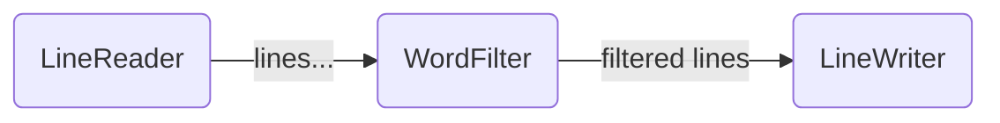

# Low-level API 01: basic nodes

In this tutorial, we will create a basic graph using the Low-Level API, to show the basic structure of a Graph.

## Example program: pseudo-`grep`

In UNIX terminals, the `grep` command reads the lines from an input file (or the standard input),
and sends to another file (or to the standard output) these lines that match an input string.
If, instead of UNIX, you are familiarized with PowerShell, the equivalent command is `Select-String`.

Reproducing the `grep` command with the `pipes` library will allows us knowing the three types
of nodes that can be attached to a processing graph:

* **Start** node: each of the starting point of a graph. This is, all the nodes that
  bring information
  from outside the graph: e.g. because they generate them or because they acquire them from an
  external source like a Web Service. A graph must have at least one Start node. A Start node must 
  send data to at least a **Middle** or a **Terminal** node.
* **Middle** node: any intermediate node that receives data from another node,
  processes/transforms/filters it,
  and forwards the data to another node. A middle node must receive data from at least
  another Start or Middle node, and node must
  send data to at least another middle or terminal node.
* **Terminal** node: any node that receives data from another node and does not forward
  it to another node, but can process it and send the results to outside the graph
  (e.g. memory, storage, web...).

Each node runs in its own goroutine, and sends/receives data to/from other
nodes via Go channels.

The `grep` example would have three nodes:

* A `LineReader` **Start** node that reads an external text source
 (a file, a socket, the standard input...) and forwards each line
  as a `string` to the `WordFilter` node.
* A `WordFilter` **Middle** node that receives string lines from an input channel
  and forwards to the output channel only these lines containing a given substring.
* A `LineWriter` **Terminal** node that receives string lines from an input channel
  and writes them to an external source (file, socket, standard output...).



## Start nodes

A start node is a node executing a `node.StartFunc[OUT]` function (being `OUT` a generic type).
It is instantiated with the function `node.AsStart(node.StartFunc[OUT])`, so we need
to implement the `StartFunc` that will implement the `LineReader`.

A `StartFunc[OUT]` is a function that receives a writable channel as argument and sends
values to it. This is the signature of the `StartFunc[OUT]` type:

```go
type StartFunc[OUT any] func(out chan<- OUT)
```

The `StartFunc` can be embedded into the invocation of the `node.AsStart` function,
but we will return it from another provider function that accepts the lines source
as an argument:

```go
// LineReader returns a node.StartFunc[string] that will read each text line
// from the provided io.Reader and will forward it to the output channel
// of the node.
func LineReader(input io.Reader) node.StartFunc[string] {
  return func (out chan<- string) {
    scan := bufio.NewScanner(input)
    for scan.Scan() {
        out <- scan.Text()
    }
    if err := scan.Err(); err != nil {
        log.Println("error scanning", err)
    }
    // when the start function ends, the output channel will
    // be automatically closed
  }
}

```

## Middle Nodes

A middle node is a node executing a `node.MiddleFunc[IN, OUT]` function, being `IN` and
`OUT` generic types for the input and the output of the node. Middle nodes are instantiated
with the function `node.AsMiddle(node.MiddleFunc[IN, OUT])`. For the example, the passed
`MiddleFunc` needs to convert the input strings to uppercase and forward them to the
output.

A `node.MiddleFunc[IN, OUT]` is a function that receives a readable channel as first
argument and a writable channel as second argument. It should read all the values from
the input channel (until it is closed by the previous node stage) and, optionally,
forward other values to the output channel.

The signature for the `MiddleFunc` is:

```go
type MiddleFunc[IN, OUT any] func(in <-chan IN, out chan<- OUT)
```

The `IN` and `OUT` types of the middle function can be different but, when we later
connect the nodes, we need to make sure that the `OUT` type of the sender node is
the same as the `IN` type of its receiver node.

To generate a Middle node, a provided `MiddleFunc` must be passed to the `node.AsMiddle`,
which accepts any function literal. Similarly to the previous section, we will
return the `MiddleFunc` from a `WordFilter` function that accepts a `string`
as argument:

```go
// WordFilter returns a node.MiddleFunc[string, string] that will read
// each text line from the input channel and will forward to the output
// channel the lines that contain the match argument as a substring.
func WordFilter(match string) node.MiddleFunc[string, string] {
  return func(in <-chan string, out chan<- string) {
    for line := range in {
      // the input line will be only forwarded if it contains the match substring
      if strings.Contains(line, match) {
        out <- line
      }
    }
  }
}

```

## Terminal Nodes

A Terminal node is a node executing a `node.TerminalFunc[IN]` function,
being `IN` a generic type for the input channel of the node.

A `node.TerminalFunc[IN]` is a function that receives a readable channel
as argument. It should read all the values from the input channel,
and do whatever it's needed with them (forwarding outside of the graph
via web services, persist them, print them...).

The signature for the `TerminalFunc` is:

```go
type TerminalFunc[IN any] func(out <-chan IN)
```

As per the middle nodes, the `IN` type of the terminal node must coincide
with the `OUT` type of the start or middle node that sends data to it.

Analogously to the start and middle nodes, the `node.AsTerminal` function
accepts any function that fulfills the `node.TerminalFunc[IN]` signature.

In this tutorial, the `LineWriter` function is the terminal node that
will write all the filtered lines in the `grep` implementation.

```go
// LineWriter returns a node.TerminalFunc[string] that reads all the lines from
// the input channel and forwards them to the provided output io.Writer.
func LineWriter(output io.Writer) node.TerminalFunc[string] {
  return func(in <-chan string) {
    for line := range in {
      // ignore error handling for the sake of brevity
      _, _ = output.Write(append([]byte(line), '\n'))
    }
  }
}
```

When the input channel is closed by the sender node and the terminal node
stops processing all the input, the `for` loop will exit and the node
will finish its execution. 

When all the terminal nodes of a graph have finished its execution, we can
consider that the execution of the graph has ended, since this condition
will be true only when all the previous nodes have also ended.

## Graph creation

First, we need to instantiate all the start, middle, and terminal nodes,
providing the configuration:

```go
// file mock, can be any implementer or io.Reader
inputText := strings.NewReader(
                    "hello my friend\n" +
                    "how are you?\n" +
                    "hello again\n" +
                    "but bye")
// Instantiation
start := node.AsStart(LineReader(inputText))
middle := node.AsMiddle(WordFilter("hello"))
terminal := node.AsTerminal(LineWriter(os.Stdout))
```

In the above example, the Start node will read a 4-lines input text,
the MiddleNode will filter each line containing the `"hello"` substring
and the Terminal node will write the filtered lines to the standard
output.

In addition to the creation of the nodes, you need to connect them
by means of the `SendTo` method, so the `LineReader` start node will
send data to the `WordFilter` middle node, and `WordFilter` will send
data to the `LineWriter` terminal node:

```go
start.SendTo(middle)
middle.SendTo(terminal)
```

A node can send data to multiple nodes, and the data will be sent
once and only once to each destination node. A node can receive data
from multiple nodes, and its input channel will be automatically closed 
only when all the sending nodes ended.

To start processing, we need to explicitly start all the `Start` nodes (in this case,
we only have one start node). This will automatically start the rest of the
graph nodes:

```go
start.Start()
```

`Start` methods run in background so we need to make sure we wait for the
graph end before exiting the program. This means, to wait for all the
terminal nodes to finish (in this case, we will wait for the unique terminal node):

```go
<-terminal.Done()
```

`Done` returns a channel that is closed when the Terminal node has ended its processing.
This is, when all its inputs have been also closed.

Waiting for all the Terminal nodes to finish allows blocking the execution
until all the data in the graph has been processed and all the
previous stages have ended.

## Execution

Running the example in this tutorial should result in a similar output to
the following:

```
hello my friend
hello again
```

Observe that the input lines that don't contain `hello` have been filtered out
from the output.
