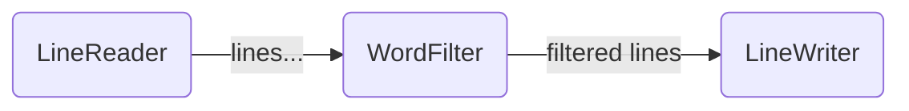
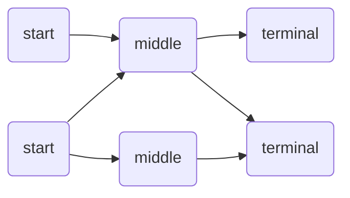
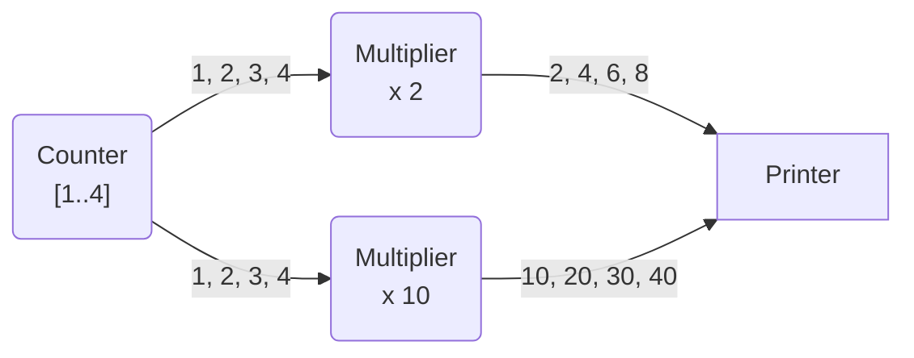

# Low-level API 02: how node connections work

In the [previous tutorial](../01-nodes), we shown a pipeline-like graph, where each
node had only one sender and/or receiver node:



However, the Pipes library supports graph-like structures, where each node can send data
to multiple nodes and/or receive data from multiple nodes:



The only condition is to not create any cycle in the graph.

The Piles library overcomes some restrictions of the Go channels API, facilitating some
operation like joining or cloning channels:

* While a Go channel with multiple readers will share its contents making sure that
  each item in the channel **is received by one and only one sender**, a Start or Middle
  node with multiple receivers will make sure that each submitted item is received
  **once and only once by each receiver**.
* While Go channel reader that gets information from multiple channels would need to
  **poll each channel individually**, the Pipes library will make sure that a Middle 
  or Terminal node receiving data from multiple sources will be able to 
  **read all the data from a single channel**.

The Pipes library will also take care to automatically close the communication channels
and coordinate the process to ensure that:
* No sender node will try to send data to a channel that has been already closed.
* No receiver node will get its input channel closed while there are other nodes 
  sending data to it.

As an example, let's have a look at the following simple node functions. The
[previous tutorial](../01-nodes) explained the basics of each type of node and function:

```go
// Counter returns a start function that forwards, in order,
// the numbers in the inclusive range passed as arguments.
func Counter(from, to int) node.StartFunc[int] {
	return func(out chan<- int) {
		for n := from; n <= to; n++ {
			out <- n
		}
	}
}

// Multiplier multiplies by a factor and forwards the numbers
// received by its input channel.
func Multiplier(factor int) node.MiddleFunc[int, int] {
	return func(in <-chan int, out chan<- int) {
		for n := range in {
			out <- n * factor
		}
	}
}

// Printer just prints by the standard output each received number.
func Printer() node.TerminalFunc[int] {
	return func(in <-chan int) {
		for n := range in {
			fmt.Println(n)
		}
	}
}
```

Instead of a linear pipeline, let's try a graph-like structure like:



Observe that:
* The `Counter` node is programmed to submit once `1, 2, 3, 4`, however the Pipes library
  will replicate the numbers to make sure that all the destination nodes receive the same
  range of numbers, in the same order.
* When a `Multiplier` ends forwarding all the input, the function exits and, under the hood,
  its output channel is closed. However, the Pipes library will make sure that the `Printer`
  node input channel won't be closed until both `Multiplier` instances have finished.

The programmatic way to create the above channel would be:

```go
// instantiate nodes
count := node.AsStart(Counter(1, 4))
mult2 := node.AsMiddle(Multiplier(2))
mult10 := node.AsMiddle(Multiplier(10))
printer := node.AsTerminal(Printer())

// connect nodes
count.SendTo(mult2, mult10)
mult2.SendTo(printer)
mult10.SendTo(printer)

// start input node
count.Start()

// wait for terminal node to finish
<-printer.Done()
```

The output of this code would be similar to:

```
2
4
10
20
30
6
8
40
```

Please notice:
* The `SendTo` method accepts multiple destination nodes, despite you could invoke it many times
  for each receiver.
* While you can be sure that the elements are received in the order they are sent, when
  two nodes send data to the same destination, there aren't any order guarantees during the
  merge of the both input sources.
