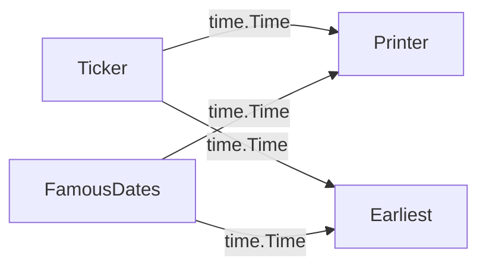

# Low-level API 03: starting and end of the process

The previous chapters of this tutorial show graphs with a single `Start`
node and a single `Terminal` node.

You can create graphs with multiple `Start`, `Middle` and `Terminal` nodes,
but in that case you need to consider the following:

* In order to properly start all the nodes of the graph, you need to explicitly
  invoke the `Start` method of each start node that you define.
* In order to make sure that your execution waits until all the nodes have
  processed all the data, you need to wait for ALL the terminal nodes to
  finish (using the `Done()` method and the channel it returns).

Let's illustrate this with an example graph containing multiple start and
terminal nodes:



The utility and meaning of each node is not really important. As an example,
we just need to know that two start nodes are generating `time.Time` objects
and submitting them to a terminal node that prints them, and another terminal
node that will aggregate them and, when all the start nodes finished submitting
their dates, will just print the earliest date.

```go
// Ticker sends the current time.Time each second, for
// a number of times specified by the ticks argument
func Ticker(ticks int) node.StartFunc[time.Time] {
	return func(out chan<- time.Time) {
		for i := 0; i < ticks; i++ {
			fmt.Println("tick!")
			out <- time.Now()
			time.Sleep(time.Second)
		}
	}
}

// FamousDates just forwards few relevant dates of the 20th century.
func FamousDates() node.StartFunc[time.Time] {
	return func(out chan<- time.Time) {
		dday, _ := time.Parse(time.DateOnly, "1944-06-06")
		out <- dday
		moon, _ := time.Parse(time.DateOnly, "1969-07-10")
		out <- moon
		berl, _ := time.Parse(time.DateOnly, "1989-11-09")
		out <- berl
	}
}

// Printer prints the received Date/Times in the standard output.
func Printer() node.TerminalFunc[time.Time] {
	return func(in <-chan time.Time) {
		for t := range in {
			fmt.Println("printing:", t.Format(time.DateTime))
		}
	}
}

// Earliest accumulates all the received time.Time and, after processing
// all of them, prints the earliest time.Time
func Earliest() node.TerminalFunc[time.Time] {
	return func(in <-chan time.Time) {
		earliest := <-in
		for t := range in {
			if earliest.After(t) {
				earliest = t
			}
		}
		fmt.Println("after finishing, the earliest date is", earliest)
	}
}
```

As for any other graph, you need to instantiate and connect all the nodes:

```go
// instantiating all the nodes
s1 := node.AsStart(Ticker(3))
s2 := node.AsStart(FamousDates())
t1 := node.AsTerminal(Printer())
t2 := node.AsTerminal(Earliest())

// connecting nodes
s1.SendTo(t1, t2)
s2.SendTo(t1, t2)
```

Now we need to start all the start nodes. As the `Start` method does not
block the execution (runs in a background goroutine), we can just invoke
it directly for each start node:

```go
// ALL the start nodes need to be explicitly started
s1.Start()
s2.Start()
```

If we run the graph in the main goroutine, we probably need to block the
execution until all the terminal nodes are finished. Otherwise the program
could end before processing all the data:

```go
// To make sure that all the data is processed, se
// need to wait for ALL the terminal nodes, as
// they might not finish simultaneously
<-t1.Done()
<-t2.Done()
```

Observe that, if the start nodes didn't finish, the terminal nodes wouldn't finish
and would keep working forever. This is fine for long-lived processes, like 
monitoring agents that run in the background of your operating system. However,
in this case the `Earliest` terminal node would be useless because it would never
end and wouldn't show any earliest date.
