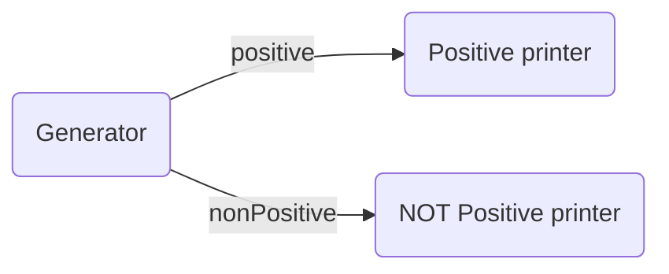
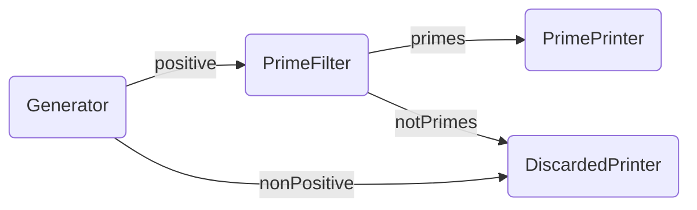

# Low-level API 04: demuxed outputs

> ℹ️ DEMUX stands for _demultiplexer_, and is a term from electronics to describe a device
that takes one single input and is able to forward it to one of its many outputs at
a time.

Usually, the nodes in the Pipes library have a single input and a single output.
You can connect that single output to the input of multiple nodes. The Pipes' library
will send then the same information to each destination node.

However, in some situations, a node might need multiple, different outputs channels
(even of different types), and select which channel to send the outcomes depending
on the desired business logic.

The Pipes library allows to define Start and Middle nodes whose output is not a regular go `chan<-`
but a type named [`node.Demux`](https://pkg.go.dev/github.com/mariomac/pipes@main/pkg/node#Demux).
Instead of [`node.AsStart`](https://pkg.go.dev/github.com/mariomac/pipes@vmain/pkg/node#AsStart)
and [`node.AsMiddle`](https://pkg.go.dev/github.com/mariomac/pipes@main/pkg/node#AsStart), the nodes whose
output is a `node.Demux` need to be instantiated with
`node.AsStartDemux` and `node.AsMiddleDemux`.

The above constructors accept a [`node.StartDemuxFunc`](https://pkg.go.dev/github.com/mariomac/pipes@main/pkg/node#StartDemuxFunc)
or a [`node.MiddleDemuxFunc`](https://pkg.go.dev/github.com/mariomac/pipes@main/pkg/node#MiddleDemuxFunc)
as arguments. These are functions that replace the output channel by a `node.Demux` instance.

`node.Demux` is a flexible way to define, during the node composition, multiple output channels with a given type
and a name. Then, inside each node, you can retrieve these channels by name and use them as
regular output channels.

For example, imagine a `Generator` function that generates some numbers and send the
positive numbers to a given output, and the non-positive numbers to another output.

You can define them following the signature of `node.StartDemuxFunc`:

```go
func Generator(outs node.Demux) {
	nonPositive := node.DemuxGet[int](outs, "nonPositive")
	positive := node.DemuxGet[int](outs, "positive")
	for i := -3; i <= 17; i++ {
		if i <= 0 {
			nonPositive <- i
		} else {
			positive <- i
		}
	}
}
```

The different output channels are retrieved from the `outs node.Demux` with
`node.DemuxGet[T]`, providing a different name for each output channel.
Observe that the output channels are arbitrarily named, and their type is given
by the type parameter of `DemuxGet`. Both are `int` in this example but they could
have different types.

In the node instantiation, you'd need to pass the `Generator` func to `node.AsStartDemux`.

Then you'd need to connect each demux output to other nodes. You'd need to use the
[`node.DemuxAdd`](https://pkg.go.dev/github.com/mariomac/pipes@main/pkg/node#DemuxAdd)
function. For example:

```go
generator := node.AsStartDemux(Generator)
posTerm := node.AsTerminal(func(in <-chan int) {
    for i := range in {
        fmt.Println(i, "is positive")
    }
})
nonPosTerm := node.AsTerminal(func(in <-chan int) {
    for i := range in {
        fmt.Println(i, "is NOT positive")
    }
})
node.DemuxAdd[int](generator, "positive").SendTo(posTerm)
node.DemuxAdd[int](generator, "nonPositive").SendTo(nonPosTerm)
```
In the above example, the demuxed output of the `generator` node is sent to two
different nodes. The `"positive"`-named output channel will send the data to the `posTerm`
node. The `"nonPositive"`-named output channel will send the data to the `nonPosTerm` node.



A single `node.Demux` output can be connected to multiple nodes, and all the destination
nodes would get the same items:

```go
node.DemuxAdd[int](generator, "positive").SendTo(posTerm, adder, statsCalculator)
```

> ⚠️ Unlike the single-channel output scenario, demuxes are not typesafe. Make sure that
> you use the same types in the `node.DemuxAdd` and `node.DemuxGet` functions for the same
> output name, and they coincide with the input types of the destination nodes.

For a bigger example, let's connect the `Generator` node to a more complex graph
that prints the generated prime numbers, on one side, and the discarded numbers
from the generator (non-prime, non-positive...).



The `DiscardedPrinter` node just accumulates all the input numbers and prints
them after the channel is closed. We send there both the not-positive and not-prime
numbers.

```go
func DiscardedPrinter(in <-chan int) {
	var discarded []int
	for i := range in {
		discarded = append(discarded, i)
	}
	fmt.Println("discarded numbers:", discarded)
}
```

The `PrimePrinter` node is similar to the `DiscardedPrinter` node, but printing
only the received prime numbers:
```go
func PrimePrinter(in <-chan int) {
	var primes []int
	for i := range in {
		primes = append(primes, i)
	}
	fmt.Println("received prime numbers:", primes)
}
```

The `PrimeFilter` is a `node.MiddleDemux` instance with two outputs. The
`primes` output is connected to the `PrimePrinter` to send all the received
prime numbers, and the `notPrimes` output is connected to the `DiscardedPrinter`
node. Observe that both outputs are acquired before starting to do
anything else:

```go
func PrimeFilter(in <-chan int, outs node.Demux) {
	primes := node.DemuxGet[int](outs, "primes")
	notPrimes := node.DemuxGet[int](outs, "notPrimes")

nextInput:
	for i := range in {
		for n := 2; n < i; n++ {
			if i%n == 0 {
				notPrimes <- i
				continue nextInput
			}
		}
		primes <- i
	}
}
```

In the `main` function, the nodes need to be instantiated and their demuxes connected
according to the above graph:

```go
generator := node.AsStartDemux(Generator)
primeFilter := node.AsMiddleDemux(PrimeFilter)
primePrinter := node.AsTerminal(PrimePrinter)
discardPrinter := node.AsTerminal(DiscardedPrinter)
node.DemuxAdd[int](generator, "nonPositive").SendTo(discardPrinter)
node.DemuxAdd[int](generator, "positive").SendTo(primeFilter)
node.DemuxAdd[int](primeFilter, "primes").SendTo(primePrinter)
node.DemuxAdd[int](primeFilter, "notPrimes").SendTo(discardPrinter)
```

And don't forget to start the `generator` node and wait for the `primePrinter` and
`discardPrinter` termination!

```go
generator.Start()

<-primePrinter.Done()
<-discardPrinter.Done()
```

The output of this program will be:

```
received prime numbers: [1 2 3 5 7 11 13 17]
discarded numbers: [-3 -2 -1 0 4 6 8 9 10 12 14 15 16]
```