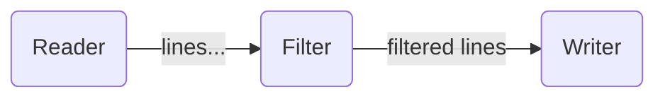

# High-Level API tutorial 01: basic nodes in High-Level API

In the previous tutorial about the [basics of the low-level API](../lowlevel/01-nodes/), the nodes
of the example graph were explicitly instantiated and connected with the `SendTo`
method.

This explicit instantiation and connection could involve a lot of boilerplate code for large
and complex graphs with many configuration options.

The Pipes' high-level API allows defining the graph nodes and its connections as an
annotated configuration struct. For the _Grepper_ example of the
[low-level API tutorial](../lowlevel/01-nodes/), the graph could be defined like:

```go
// LineReader node configuration
type LineReader struct {
	Input io.Reader
}

// WordFilter node configuration
type WordFilter struct {
	Match string
}

// LineWriter node configuration
type LineWriter struct {
	Output io.Writer
}

// Grepper defines the nodes of a processing graph
// and how they are connected each other
```go
type Grepper struct {
  Reader LineReader `sendTo:"Filter"`
  Filter WordFilter `sendTo:"Writer"`
  Writer LineWriter
}
```

The above example defines the configuration for the three nodes as 
custom structs, and a bigger `Grepper` struct that joins the
configuration of each node, as well as the the nodes are connected.

The Pipes library provides a `graph.Builder` type that would allow
generating a graph from the above configuration, but we first need
to specify how the `graph.Builder` can associate a given
configuration property with the code that will execute each node.

For that, we need to explain the concept of **Provider**.

## Defining *Providers* for each node

The high-level graph API does not use the node instantiation functions
of the low-level API (`node.AsStart`, `node.AsMiddle`, `node.AsTerminal`).
Instead, it uses the concept of a **Provider**. 

A **Provider** is a function that maps a configuration type (such as the `LineReader`,
`WordFilter` and `LineWriter` types above) with the function that
executes the code of the node. Each provider is registered in the Graph builder
to let it automatically instantiate and connect all the nodes.

A **Provider**  is a function that receives a configuration argument
and will return a `node.StartFunc`, `node.MiddleFunc` or `node.TerminalFunc` (or an error
if something failed during the instantiation). There are three types of node providers:

* `stage.StartProvider` is a function that, given a configuration argument of a unique type, returns a `node.StartFunc` function.
* `stage.MiddleProvider` is a function that, given a configuration argument of a unique type, returns a `node.MiddleFunc` function.
* `stage.TerminalProvider` is a function that, given a configuration argument of a unique type, returns a `node.TerminalFunc` function.

The signatures of the providers ares:

```go
type StartProvider[CFG, O any] func(CFG) (node.StartFunc[O], error)
type MiddleProvider[CFG, I, O any] func(CFG) (node.MiddleFunc[I, O], error)
type TerminalProvider[CFG, I any] func(CFG) (node.TerminalFunc[I], error)
```

The providers that would implement Grep stages equivalent to the
functions of the [low-level API tutorial](../lowlevel/01-nodes/),
would be:

```go
func LineReaderProvider(cfg LineReader) (node.StartFunc[string], error) {
	return func(out chan<- string) {
		scan := bufio.NewScanner(cfg.Input)
		for scan.Scan() {
			out <- scan.Text()
		}
		if err := scan.Err(); err != nil {
			log.Println("error scanning", err)
		}
	}, nil
}

func WordFilterProvider(cfg WordFilter) (node.MiddleFunc[string, string], error) {
	return func(in <-chan string, out chan<- string) {
		for line := range in {
			// the input line will be only forwarded if it contains the match substring
			if strings.Contains(line, cfg.Match) {
				out <- line
			}
		}
	}, nil
}

func LineWriterProvider(cfg LineWriter) (node.TerminalFunc[string], error) {
	return func(in <-chan string) {
		for line := range in {
			// ignore error handling for the sake of brevity
			_, _ = cfg.Output.Write(append([]byte(line), '\n'))
		}
	}, nil
}
```

Even if some of the nodes didn't need configuration values, their respective
providers would need to receive a configuration parameter that
**MUST** be of a unique type associated to this node type. If e.g. we had
multiple `stage.MiddleProvider` implementations doing different functions,
each should have a different configuration type, even if they are empty.

## Building the graph

The `graph.Builder` object allows registering all the possible node providers by means
of the `graph.RegisterStart`, `graph.RegisterMiddle` and `graph.RegisterTerminal` functions.
The invocations of these functions are the required step to map all the node
proerties in the `Grepper struct` with the functions that implement the respective nodes:

```go
// Create Graph builder and register all the node types
graphBuilder := graph.NewBuilder()
graph.RegisterStart(graphBuilder, LineReaderProvider)
graph.RegisterMiddle(graphBuilder, WordFilterProvider)
graph.RegisterTerminal(graphBuilder, LineWriterProvider)
```

The created `Builder` provides the `Build(config)` method, that accepts a
`Grepper` configuration describing the Graph properties

```go
// Build graph from a given configuration, and run it
input := strings.NewReader("hello, my friend\n" +
	"how are you?\n" +
	"I said hello but\n" +
	"I need to say goodbye")

grepper, err := graphBuilder.Build(Grepper{
	Reader: LineReader{Input: input},
	Filter: WordFilter{Match: "hello"},
	Writer: LineWriter{Output: os.Stdout},
})
if err != nil {
	log.Panic("building graph", err)
}
```

The `Build` method inspects all the fields of the `Grepper` struct, and then
for each field:

1. Checks if there is a registered Provider for its type.
2. Invokes the Provider function, passing the value of the property as argument.
3. Internally creates a node executing that function.

When all the nodes are instantiated, then the Graph Builder connects them according
to the field names and `sendTo` annotations in the `type Grepper struct` definition.

To run the graph, just execute the `Run` method of the graph:

```go
grp.Run()
```

The `Run` method blocks the execution of the current goroutine until the graph finishes
its execution. If you want to keep the execution going, you must run the graph in another
goroutine:

```go
grp.Run()
```

The above configuration will build a graph equivalent to the graph of the previous
tutorial chapter. But now each instance take its name/ID from its `nodeId`
annotation:

```go
type Grepper struct {
  Reader LineReader `sendTo:"Filter"`
  Filter WordFilter `sendTo:"Writer"`
  Writer LineWriter
}
```



As long as Go lets you embedding structs, you could also compose a graph by embedding
the structs and use the type as destination in the `sendTo` annotation:

```go
type Grepper struct {
	LineReader `sendTo:"WordFilter"`
	WordFilter `sendTo:"LineWriter"`
	LineWriter
}
```

If you want to override the node identifier that is extracted from the field name,
you can use the `nodeId` on the field to override:

```go
type Grepper struct {
  Reader LineReader `sendTo:"Filter"`
  Filter WordFilter `sendTo:"std-output"`
  Writer LineWriter `nodeId:"std-output"`
}
```

The advantage of using the high-level API to build the graphs are:

* Less boilerplate to instantiate and connect the graph nodes.
* You can get a global view of the graph just by having
  a look to a struct and its annotations (e.g. the `Grepper` struct).
* The structure representing a Graph is easily mappable to a user-provided
  configuration file, so a user could easily configure the parameters
  of a Graph via YAML, JSON, etc...


