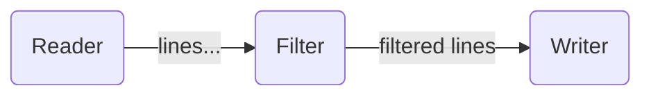
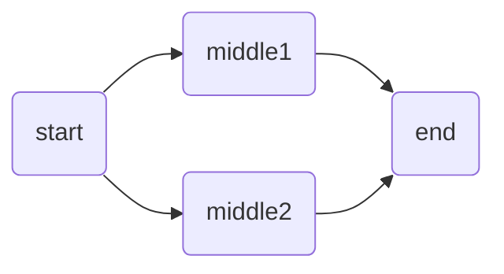
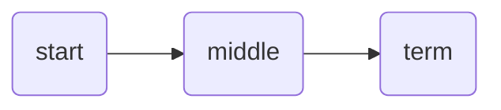
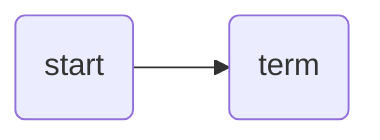

# High-Level API tutorial 02: annotations to compose a graph

The [previous tutorial](../01-basic-nodes/) shown how to use the `sendTo` annotation
to compose a graph, and barely mentioned the `nodeId` annotation to
override the node ID:

```go
type Grepper struct {
    Reader LineReader `sendTo:"Filter"`
    Filter WordFilter `sendTo:"Writer"`
    Writer LineWriter
}
```




The rest of this tutorial explains in detail all the annotations that
can be used to compose Pipes' graphs.

## `nodeId` annotation

Each struct field representing a node in the Graph requires a unique
identifier to allow referring to it. For example in the `sendTo`
annotation.

By default, the ID is the name of each struct field, but you can
override its ID with the `nodeId` annotation:

```go
type Grepper struct {
    Reader LineReader `nodeId:"r" sendTo:"f"`
    Filter WordFilter `nodeId:"f" sendTo:"w"`
    Writer LineWriter `nodeId:"w"`
}
```

If a given struct field does not correspond to any node (for example, is
just a global configuration value), you can set the value of `nodeId:"-"`
and that node will be ignored. For example:

```go
type Grepper struct {
	Reader LineReader `nodeId:"reader" sendTo:"filter"`
	Filter WordFilter `nodeId:"filter" sendTo:"writer"`
	Writer LineWriter `nodeId:"writer"`
	
	Description string `nodeId:"-"` // won't be used as node
}
```

## `sendTo` annotation

This property is mandatory for each `Start` and `Middle` node, as all of them
need to send data to another node.

`sendTo` annotation will specify the destination node for the data forwarded
by the node annotated with it. If a node needs to send to other multiple nodes,
you can specify the name of each destination node separated by comma. For
example:

```go
type MyGraph struct {
	Start Start `nodeId:"start" sendTo:"middle1,middle2"`
	Middle1 Middle1 `nodeId:"middle1" sendTo:"end"`
	Middle2 Middle2 `nodeId:"middle2" sendTo:"end"`
	End End `nodeId:"end"`
}
```



## `forwardTo` annotation

In the next tutorial, we will talk about [dynamically enabling/disabling nodes](../03-optional)
depending on the provided configuration.

The `forwardTo` annotation replaces the `sendTo` annotation, and will have the same
behavior if the node is enabled.
In the case that the node is disabled, it will bypass the received data to the node or
comma-separated nodes specified in the `forwardTo` annotation.

Example:

```go
type Config struct {
    Start  CounterCfg   `nodeId:"start" sendTo:"middle"`
    Middle *NillableCfg `nodeId:"middle" forwardTo:"term"`
    Term   MapperCfg    `nodeId:"term"`
}
```

If the `NillableCfg` is not `nil`, the Graph would behave as:



If the `NillableCfg` field is `nil`, it means it is disabled so the graph would
behave as:

