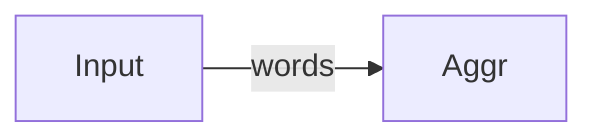

# High-Level API tutorial 03: optional nodes

Imagine we want to construct a program that reads a text string and,
after processing all its words, shows a list of anagrams contained in the
input text.

With the pipe's library, we could setup a two-nodes graph: a Start node built from
an `Input` string, which splits the string in words and forwards them
one by one via the output channel; and another Terminal node that just
reads the words and groups them with other anagrams, and prints the anagram at the
end:

```go
// InputWords is a string containing multiple words
type InputWords string

// WordReaderProvider provides a Start function that splits the words
// in the input string and submits them individually to the output channel.
func WordReaderProvider(input InputWords) (node.StartFunc[string], error) {
	return func(out chan<- string) {
		notWords := regexp.MustCompile("[^a-zA-Z\u00C0-\u017F]")
		for _, word := range notWords.Split(string(input), -1) {
			if len(word) > 0 {
				out <- word
			}
		}
	}, nil
}

// Aggregator is an empty type only used to define the associated node in the Graph.
type Aggregator struct{}

// AggregatorProvider reads all the words from the input channel and, after the channel
// is closed and all the words are read, it shows the anagrams.
func AggregatorProvider(_ Aggregator) (node.TerminalFunc[string], error) {
    return func(in <-chan string) {
        anagrams := map[string][]string{}
        alreadyChecked := map[string]struct{}{}
        for word := range in {
            if _, ok := alreadyChecked[word]; ok {
                continue
            }
            alreadyChecked[word] = struct{}{}
			// sorting the letters by alphabetical order
			// allows us identifying anagrams
            sorted := []byte(word)
            sort.Slice(sorted, func(i, j int) bool {
                return sorted[i] < sorted[j]
            })
            anagrams[string(sorted)] = append(anagrams[string(sorted)], word)
        }
        fmt.Println("list of anagrams:")
        for _, vals := range anagrams {
            if len(vals) > 1 {
                fmt.Println(strings.Join(vals, ", "))
            }
        }
    }, nil
}
```

We can define the processing graph with the `AnagramFinder` struct:

```go
type AnagramFinder struct {
	Input  InputWords `sendTo:"Aggr"`
	Aggr   Aggregator
}
```

Resulting in a graph like:



Running the following code:

```go
gb := graph.NewBuilder()
graph.RegisterStart(gb, WordReaderProvider)
graph.RegisterTerminal(gb, AggregatorProvider)

finder, err := gb.Build(AnagramFinder{
    Input: `The hôtel of letho is the first fistr of a rank from Nark Kran on eth!`,
    // Please notice that we don't really need to instantiate the Aggregator field,
    // as its empty value is already an Aggregator{} instance		
})
if err != nil {
    panic(err)
}
finder.Run()
```

Would result in the following output:

```
list of anagrams:
the, eth
first, fistr
```

It shown two groups of anagrams, but we might identify others in the input text.
For example `hôtel` and `letho`, despite they might not mean anything, could be
considered as anagrams even if `ô` and `o` are different characters in terms of
unicode value.

We might want to add an `Untilder` node that is instantiated an run only on demand,
and otherwise left uninstantiated to save resources.

## Optional nillable values

The Pipes library allows setting optional nodes if we use a nillable pointer to
define it in either the struct and the provider:

```go
// Untilder is an empty type, only used to define that node in the
// Graph struct.
type Untilder struct{}

// UntilderProvider returns a middle func that replaces vowels and consonants with
// a tilde by their "non-tilded" similar. For example it would replace each ñ by n
// or each ô by o.
func UntilderProvider(_ *Untilder) (node.MiddleFunc[string, string], error) {
	return func(in <-chan string, out chan<- string) {
		for tilded := range in {
			untilded := make([]byte, len(tilded))
			t := transform.Chain(norm.NFD, runes.Remove(runes.In(unicode.Mn)), norm.NFC)
			ln, _, _ := t.Transform(untilded, []byte(tilded), true)
			out <- string(untilded[:ln])
		}
	}, nil
}

type AnagramFinder struct {
    Input  InputWords `sendTo:"Untild"`
    Untild *Untilder  `forwardTo:"Aggr"`
    Aggr   Aggregator
}
```

Let me emphasize that the type of the `Untild` field is not `Untilder` but
`*Untilder`, so the `UntilderProvider` function needs to receive an `*Untilder`
pointer instead of a value.

Please also notice the `forwardTo` tag in the `Untild` field. As mentioned
in the previous [tutorial about the field annotations](../02-annotations),
it usually used by the optional nodes to specify:
* If the `Untild` node is enabled, it will receive the data from the `Input` node,
  and the output from `Untild` will be submitted to the `Aggr` node.
* If the `Untild` node is disabled, the data from the `Input` node will be directly
  sent to the `Aggr` node.

So if we run the following main code:
```go
gb := graph.NewBuilder()
graph.RegisterStart(gb, WordReaderProvider)
graph.RegisterMiddle(gb, UntilderProvider)
graph.RegisterTerminal(gb, AggregatorProvider)

finder, err := gb.Build(AnagramFinder{
    Input:  `The hôtel of letho is the first fistr of a rank from Nark Kran on eth!`,
})
if err != nil {
    panic(err)
}
finder.Run()
```

The output will be the same as in the previous case, as the `Untild` field is `nil`:
```
list of anagrams:
first, fistr
the, eth
```

But if we instantiate the `AnagramFinder` as:
```go
finder, err := gb.Build(AnagramFinder{
    Input: `The hôtel of letho is the first fistr of a rank from Nark Kran on eth!`,
    Untild: &Untilder{},
})
```
It will then ignore the tildes in the anagrams (as in `hôtel`, `letho`);
```
list of anagrams:
the, eth
first, fistr
hotel, letho
```

## Optional values implementing the `Enabler` interface

There are values that can't be nil, or we just want to enable or disable
them not as a function of its `nil` value but as a function of a given
property.

You can programmatically enable or disable a node by letting its
node type to implement the `Enabler` interface:

```go
type Enabler interface {
    Enabled() bool
}
```

The `Enable` method of the `Enabler` interface returns a boolean value indicating
whether the associated node must be enabled (`true`) or disabled (`false`).
This is useful for non-nillable configurations that need to be disabled if e.g.
a property is missing.

For example, the previous example missed the anagrams `rank`, `Nark`, `Kran` because
the upper/lowercase letters haven't equal numeric values. To solve that,
we could add new optional node that would convert the words either to upper or
lower case on the users' demand:

```go
// CasingType indicates a transformation to do to a word: none, convert to upper case
// or convert to lower case.
type CasingType int

const None = CasingType(0)
const ToUpper = CasingType(1)
const ToLower = CasingType(2)

// Enabled returns true if the node that is associated to that CasingType is
// enabled (e.g. because it needs to transform each word), and false if the
// node is disabled (won't be started to save computing resources).
func (c CasingType) Enabled() bool {
	return c == ToUpper || c == ToLower
}

// CasingProvider returns a middle function that transforms and submits each received
// word according to the provided CasingType
func CasingProvider(c CasingType) (node.MiddleFunc[string, string], error) {
	return func(in <-chan string, out chan<- string) {
		for i := range in {
			if c == ToLower {
				out <- strings.ToLower(i)
			} else {
				out <- strings.ToUpper(i)
			}
		}
	}, nil
}

type AnagramFinder struct {
    Input  InputWords `sendTo:"Untild"`
    Untild *Untilder  `forwardTo:"Caser"`
    Caser  CasingType `forwardTo:"Aggr"`
    Aggr   Aggregator
}
```

Please notice some important details in the above code:

* The type representing a graph node doesn't have to be a struct. In this case,
  `CasingType` has `int` as a base type.
* The `Enabled` method needs to be implemented by using a value as a receiver,
  as the `Caser` struct field is `CasingType`.
  
Now you can update the main code to run:

```go
gb := graph.NewBuilder()
graph.RegisterStart(gb, WordReaderProvider)
graph.RegisterMiddle(gb, CasingProvider)
graph.RegisterMiddle(gb, UntilderProvider)
graph.RegisterTerminal(gb, AggregatorProvider)

finder, err := gb.Build(AnagramFinder{
    Input: `The hôtel of letho is the first fistr of a rank from Nark Kran on eth!`,
    Caser:  ToLower,
    Untild: &Untilder{},
})
if err != nil {
    panic(err)
}
finder.Run()
```

And the output:
```
list of anagrams:
HOTEL, LETHO
THE, ETH
FIRST, FISTR
RANK, NARK, KRAN
```

Now you can try modifying the values for `Caser` and `Untild` and
observe with the debugger (or just insert `Println`s) whether
Pipes instantiates or not the corresponding nodes in the graph.