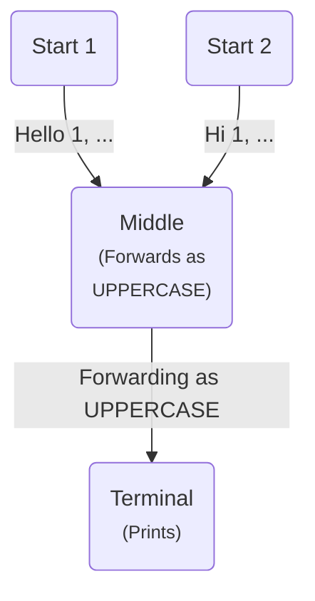

# Tutorial 01: basic nodes in Low-Level API

In this tutorial, we will create a basic graph using the Low-Level API:

```mermaid
graph TD
    S1(Start 1) -->|Hello 1, ...| M("Middle<br/><small>(Forwards as<br/>UPPERCASE)")
    S2(Start 2) -->|Hi 1, ...| M
    M -->|Forwarding as UPPERCASE| T("Terminal<br/><small>(Prints)</small>")
```