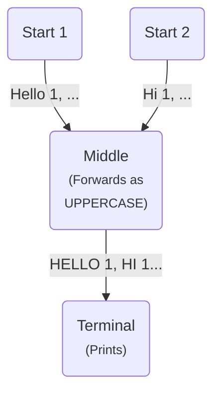

# Tutorial 01: basic nodes in Low-Level API

In this tutorial, we will create a basic graph using the Low-Level API, to show the basic structure of a Graph.

A graph is composed by 3 types of nodes:

* **Start** node: each of the starting point of a graph. This is, all the nodes that
  bring information
  from outside the graph: e.g. because they generate them or because they acquire them from an
  external source like a Web Service. A graph must have at least one Start node. A Start node must 
  have at least one output node.
* **Middle** node: any intermediate node that receives data from another node,
  processes/transforms/filters it,
  and forwards the data to another node. A Middle node must have at least one output node.
* **Terminal** node: any node that receives data from another node and does not forward
  it to
  another node, but can process it and send the results to outside the graph
  (e.g. memory, storage, web...).

Each node runs in its own goroutine, and sends/receives data to/from other
nodes via Go channels.

The example graph of this tutorial will have the following nodes (see image below):



* Two start Nodes that just sends few strings to the next stage of the graph. A start node
  will generate send `"Hello, 1"`, `"Hello, 2"` and `"Hello, 3"` strings, and the other
  node will generate and send `"Hi, 1"`, `"Hi, 2"` and `"Hi, 3"`.
* A Middle node that accepts string values and forwards them in upper case. So if it
  receives the strings from the input nodes, it will forward `"HELLO, 1"`, `"HELLO, 2"`, `"HELLO, 3"`, `"HI, 1"`, `"HI, 2"` and `"HI, 3"` to the next stage.
  - It is important to mention that the input from a single node is processed in order,
    so `"Hi, 1"` will be always processed before `"Hi, 2"`. However, there are no order
    guarantees for the inputs of two nodes, so `"Hi"` and `"Hello"` strings will be
    probably merged.
* A Terminal node that accepts strings and prints it into the Standard output.

## Start nodes

A start node is a node executing a `node.StartFunc[OUT]` function (being `OUT` a generic type).
It is instantiated with the function `node.AsStart(node.StartFunc[OUT])`, so we need
to implement the `StartFunc` that will generate the `"Hello"` and `"Hi"` messages.

A `StartFunc[OUT]` is a function that receives a writable channel as argument and sends
values to it. This is the signature of the `StartFunc[OUT]` type:

```go
type StartFunc[OUT any] func(out chan<- OUT)
```

The `StartFunc` can be embedded into the invocation of the `node.AsStart` function,
but we will return it from another provider function that accepts a configuration:

```go
type StartConfig struct {
	Prefix string
}

func StartProvider(cfg StartConfig) node.StartFunc[string] {
	return func(out chan<- string) {
		out <- cfg.Prefix + ", 1"
		out <- cfg.Prefix + ", 2"
		out <- cfg.Prefix + ", 3"
	}
}
```

Both start nodes execute the function provided by the `StartProvider`, passing different
values for the `StartConfig`. The passed `StartFunc` will send three strings and, when
it ends, the Start node is considered as ended and the output channel is automatically
closed.

## Middle Nodes

A middle node is a node executing a `node.MiddleFunc[IN, OUT]` function, being `IN` and
`OUT` generic types for the input and the output of the node. Middle nodes are instantiated
with the function `node.AsMiddle(node.MiddleFunc[IN, OUT])`. For the example, the passed
`MiddleFunc` needs to convert the input strings to uppercase and forward them to the
output.

A `node.MiddleFunc[IN, OUT]` is a function that receives a readable channel as first
argument and a writable channel as second argument. It should read all the values from
the input channel (until it is closed by the previous node stage) and, optionally,
forward other values to the output channel.

The signature for the `MiddleFunc` is:

```go
type MiddleFunc[IN, OUT any] func(in <-chan IN, out chan<- OUT)
```

The `IN` and `OUT` types of the middle function can be different but, when we later
connect the nodes, we need to make sure that the `OUT` type of the sender node is
the same as the `IN` type of the receiver node.

To generate a Middle node, a provided `MiddleFunc` must be passed to the `node.AsMiddle`,
which accepts any function literal but we will return it from a *provider* with a similar
structure as the `StartProvider` from the previous section:

```go
func MiddleProvider() node.MiddleFunc[string, string] {
	return func(in <-chan string, out chan<- string) {
		for i := range in {
			out <- strings.ToUpper(i)
		}
	}
}
```

The function returned by `MiddleProvider()` reads completely the input channel and
forwards each received function as an input channel. Only when all the Start nodes that send
the data are finished, they will automatically close their output channel (which is the
input channel of this Middle node). When the Middle node processes all the input,
the `for` loop will end and the node will finish its execution, also closing its
output channel.

## Terminal Nodes

A Terminal node is a node executing a `node.TerminalFunc[IN]` function,
being `IN` a generic type for the input channel of the node.

Terminal nodes are instantiated with the function
`node.AsTerminal(node.TerminalFunc[IN])`. In the example, the passed
`TerminalFunc` just reads all the input strings and prints it into the
standard output.

A `node.TerminalFunc[IN]` is a function that receives a readable channel
as argument. It should read all the values from the input channel,
and do whatever it's needed with them (forwarding outside of the graph
via web services, persist them, print them...).

The signature for the `TerminalFunc` is:

```go
type TerminalFunc[IN any] func(out <-chan IN)
```

As per the middle nodes, the `IN` type of the terminal node must coincide
with the `OUT` type of the start or middle node that sends data to it.

Analogously to the start and middle nodes, the `node.AsTerminal` function
accepts any function that fulfills the `node.TerminalFunc[IN]` signature.
For the example, we created a `TerminalProvider` that returns the terminal
function that prints all received strings:

```go
func TerminalProvider() node.TerminalFunc[string] {
	return func(in <-chan string) {
		for i := range in {
			fmt.Println(i)
		}
	}
}
```

When the input channel is closed by the sender node and the terminal node
stops processing all the input, the `for` loop will exit and the node
will finish its execution. 

When all the terminal nodes of a graph have finished its execution, we can
consider that the execution of the graph has ended, since this condition
will be true only when all the previous nodes have also ended.

## Graph creation

First, we need to instantiate all the start, middle, and terminal nodes:

```go
start1 := node.AsStart(StartProvider(StartConfig{Prefix: "Hello"}))
start2 := node.AsStart(StartProvider(StartConfig{Prefix: "Hi"}))
middle := node.AsMiddle(MiddleProvider())
terminal := node.AsTerminal(TerminalProvider())
```

Then, you need to connect the nodes according to the graph depicted
at the start of this tutorial chapter:

```go
start1.SendsTo(middle)
start2.SendsTo(middle)
middle.SendsTo(terminal)
```

A node can send data to multiple nodes, and the data will be sent
once and only once to each destination node. A node can receive data
from multiple nodes, and its input channel will be automatically closed 
only when all the sending nodes ended.

To start processing, we need to start all the `Start` nodes. This will
automatically start the rest of the graph:

```go
start1.Start()
start2.Start()
```

`Start` methods run in background so we need to make sure we wait for the
graph end before exiting the program. This means, to wait for all the
terminal nodes to finish
(in this case, we will wait for the only terminal node):

```go
<-terminal.Done()
```

`Done` returns a channel that is closed when the Terminal node has ended its processing. This is, when all its inputs have been also closed.

Waiting for all the Terminal nodes to finish allows blocking the execution
until all the data in the graph has been processed and all the
previous stages have ended.

## Execution

Running the example in this tutorial should result in a similar output to
the following:

```
HI, 1
HELLO, 1
HELLO, 2
HI, 2
HI, 3
HELLO, 3
```
