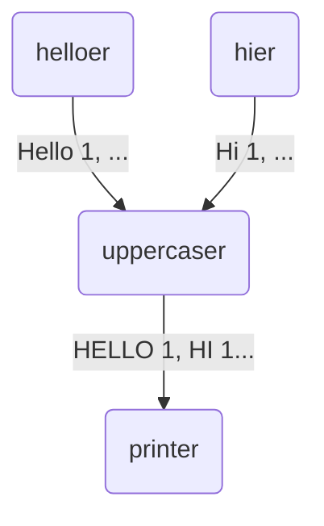

# Tutorial 02: basic nodes in High-Level API

In the previous tutorial about the [basics of the low-level API](../01-lowlevel-nodes/), the example graph was statically built during the
coding time. This is, its architecture was known at compile time.

In some other scenarios, we would like to let the users of our software
to define the structure of the graph, by providing them a set of
predefined node types and allow them to select which ones will be
executed, how many, and how they are connected.

## Defining *Providers* for each node

Instead of manually invoking each `node.AsStart`, `node.AsMiddle`,
and `node.AsTerminal` function and pass them, respectively,
`node.StartFunc`, `node.MiddleFunc` and `node.TerminalFunc` instances,
we will define a set **Node Providers**, which will be automatically
invoked by the later mentioned **Graph builder** to automatically
instantiate and connect them.

A **Provider**  is a function that receives a configuration argument
and will return a `node.StartFunc`, `node.MiddleFunc` or `node.TerminalFunc`. There are three types of node providers:

* `stage.StartProvider` is a function that, given a configuration argument of a unique type, returns a `node.StartFunc` function.
* `stage.MiddleProvider` is a function that, given a configuration argument of a unique type, returns a `node.MiddleFunc` function.
* `stage.TerminalProvider` is a function that, given a configuration argument of a unique type, returns a `node.TerminalFunc` function.

The signatures of the providers ares:

```go
type StartProvider[CFG Instancer, O any] func(CFG) node.StartFunc[O]
type MiddleProvider[CFG Instancer, I, O any] func(CFG) node.MiddleFunc[I, O]
type TerminalProvider[CFG Instancer, I any] func(CFG) node.TerminalFunc[I]
```

The `*Provider` functions of the [previous tutorial](../01-lowlevel-nodes/)
are very similar to the provider interfaces. But we slightly need to
modify the `MiddleProvider` and `TerminalProvider` functions to fulfill
the `stage.MiddleProvider` and `stage.TerminalProvider` signatures:

```go
func StartProvider(cfg StartConfig) node.StartFunc[string] {
	return func(out chan<- string) {
		out <- cfg.Prefix + ", 1"
		out <- cfg.Prefix + ", 2"
		out <- cfg.Prefix + ", 3"
	}
}

func MiddleProvider(_ MiddleConfig) node.MiddleFunc[string, string] {
	return func(in <-chan string, out chan<- string) {
		for i := range in {
			out <- strings.ToUpper(i)
		}
	}
}

func TerminalProvider(_ TerminalConfig) node.TerminalFunc[string] {
	return func(in <-chan string) {
		for i := range in {
			fmt.Println(i)
		}
	}
}
```

Even if the `MiddleProvider` and `TerminalProvider` functions don't need
to be configured, they need to receive a configuration parameter that
**MUST** be of a unique type associated to this node type. If e.g. we had
multiple `stage.MiddleProvider` implementations doing different functions,
each should have a different configuration type, even if they are empty.

The passed configuration types need to fulfill the `stage.Instancer`
interface, which allows identifying each stage instance by a string name.
For convenience, the interface is automatically implemented by embedding
the `stage.Instance` type:

```go
type StartConfig struct {
	stage.Instance
	Prefix         string
}
type MiddleConfig struct {
	stage.Instance
}
type TerminalConfig struct {
	stage.Instance
}
```

## Defining the graph configuration

To allow the users configuring the graph, we need to add the above
configuration fields to a custom graph configuration struct (which
could be later loaded from YAML, JSON, XML...).

Each possible instance of the above node types can go in its own
struct field. If there are multiple possible instances of the same
node type, they can go in different struct fields or just in an array,
as the configuration created for the example in this tutorial:

```go
type Config struct {
	graph.Connector
	Starts          []StartConfig
	Middle          MiddleConfig
	Terminal        TerminalConfig
}
```

In the above configuration, you can define only one middle and terminal node,
but you can define multiple start nodes.

The Configuration required by the graph must implement the `graph.ConnectedConfig` interface, which allows wiring all the instance IDs together. For convenience, the `graph.Connector` type is provided. It
can be embedded in the struct and will allow defining all the connections
as a `map[string][]string` field, where the Key is the instance ID of a 
given node and the Value is a slice with all the nodes that are the
receivers of that node.

## Building the graph

The `graph.Builder` object allows registering all the possible node providers by means
of the `graph.RegisterStart`, `graph.RegisterMiddle` and `graph.RegisterTerminal` functions:

```go
builder := graph.NewBuilder()

graph.RegisterStart(builder, StartProvider)
graph.RegisterMiddle(builder, MiddleProvider)
graph.RegisterTerminal(builder, TerminalProvider)
```

The created `Builder` provides the `Build(config)` method, that accepts a configuration
describing the Graph: each node instance with its Instance ID, and the map of connections:

```go
grp, err := builder.Build(Config{
    Starts: []StartConfig{
        {Instance: "helloer", Prefix: "Hello"},
        {Instance: "hier", Prefix: "Hi"},
    },
    Middle:   MiddleConfig{"uppercaser"},
    Terminal: TerminalConfig{"printer"},
    Connector: graph.Connector{
        "helloer":    []string{"uppercaser"},
        "hier":       []string{"uppercaser"},
        "uppercaser": []string{"printer"},
    },
})
```

The above configuration will build a graph equivalent to the graph of the previous
tutorial chapter. But now each instance have a name that is used in the `Connector`
field:



For simplicity, the configuration is hardcoded but ideally you would instantiate it
from a user-provided JSON, YAML or other configuration file, allowing the user 
to define how many instances are built and how they are connected.


