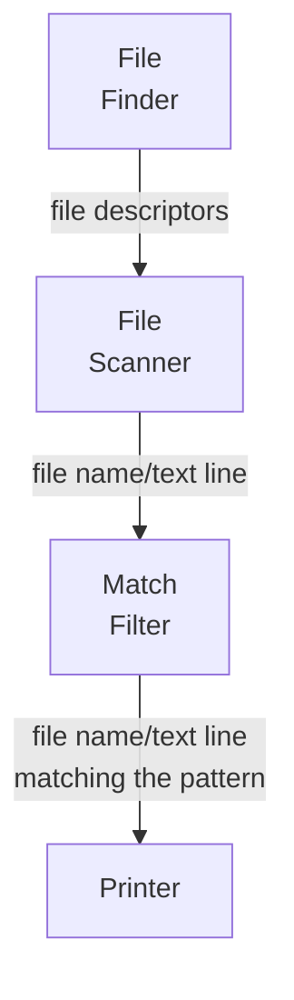

# Tutorial: Minigrep

Source code: [./minigrep](./minigrep)

To learn the basics of the [Pipes](https://github.com/mariomac/pipes) library, w
we will create our own [`grep`-like](https://en.wikipedia.org/wiki/Grep) command-line
tool: `minigrep`.

Its behavior is simple: you invoke it from the command line passing a regular expression
as a first argument, and a set of files as subsequent arguments.

Minigrep will search in all the files and, for each file line matching the provided
pattern, it will print the matching line as well as the file containing it.

If no files are provider, Minigrep will process the text lines from the
standard input.

Example:

```
$ minigrep
usage: minigrep pattern [file ...]

$ minigrep chan *.go
minigrep.go:    return func(out chan<- *os.File) {
minigrep.go:func FileScanner(in <-chan *os.File, out chan<- FileLine) {
minigrep.go:            return func(in <-chan FileLine, out chan<- FileLine) {
minigrep.go:func Printer(in <-chan FileLine) {

$  echo "Hello! This is a minigrep demo.
not all the lines are going to be printed
only those containing hello" | minigrep "[Hh]ello"

Hello! This is a minigrep demo.
only those containing hello
```

## Nodes and connections

The [Pipes library](https://github.com/mariomac/pipes) allows to define
and connect processing nodes that run independently and might receive and/or send
information from/to other nodes in the pipeline.

Based on these building blocks, we could decompose the Minigrep application
in the following Nodes:

* A node that, given a list of file names, opens them for read and forwards
  their file descriptors to the next stage of the processing pipeline. We will
  name this node as **File Finder**.
* A node that receives the file descriptors and, for each file descriptor,
  reads its text contents line by line, and forwards each line individually
  to the next pipeline stage. This node is named **File Scanner**.
* A node that, receiving individual text lines, checks if they match the
  user-provided regular expression pattern. It will forward to the next
  pipeline stage only the matching lines. This node is named **Match Filter**.
* A node that just receives text lines and prints them to the standard output.
  We will name it **Printer**.



Each processing node is defined by a function that has an input channel to
receive the information, or an output channel to forward the information,
or both. The input and output channels don't have to be of the same type.

Depending of the position of the node of each node in the pipeline or graph
of nodes, there are three types of nodes:

**Start** nodes read or generate the data to be submitted to the pipeline.
They are composed by a function with only an output channel, defined generically
as:
```go
type StartFunc[OUT any] func(out chan<- OUT)
```

In the previous diagram, the **File Finder** is a start node, as it transforms
the user-provided arguments into file descriptors and forwards them to the pipeline.

**Final** nodes receive information via an input channel and takes it out of the
pipeline. Their internal function is defined generically as:
```go
type FinalFunc[IN any] func(in <-chan IN)
```

In the example diagram, the **Printer** is a final node, as it receives text lines
from the pipeline and prints them to the standard output (but don't forward them
to any other further node. 

**Middle nodes** are placed between start, final, and other middle nodes. They
have both input and output channels and they usually transform, filter or convert the
input data before forwarding it to the next node. Their internal function is
defined generically as:

```go
type MiddleFunc[IN, OUT any] func(in <-chan IN, out chan<- OUT)
```

Each pipeline or graph must have at least one start node and one final node.

Before keep investigating on how nodes are connected, let's first code the
individual nodes.

### File finder node

The File finder node requires a slice of file names as input argument, but the
above `StartFunc` definition only accepts an output channel as argument.

To overcome this, we will create a function that accepts the list of files, and
returns a `StartFunc` implementation that will be invoked later by the pipes library.

```go
// FileFinder opens the files passed as argument and forwards them to the next
// pipeline stage.
// If the file is not found or can't be opened, it just prints a message in the
// standard error.
func FileFinder(files []string) pipe.StartFunc[*os.File] {
	return func(out chan<- *os.File) {
		// if no file patterns are provided, minigrep filters standard input
		if len(files) == 0 {
			out <- os.Stdin
		}
		for _, fname := range files {
			if handler, err := os.Open(fname); err != nil {
				fmt.Fprintf(os.Stderr, "%s: %s\n", fname, err.Error())
			} else {
				out <- handler
			}
		}
	}
}
```

### File scanner node

The file scanner node function is simpler, as it does not require extra arguments
rather than the input channel where it receives the file handlers from the previous
stage, and the output channel where it forwards the lines.

Observe that:

1. The input and output types are different. A Middle node can change the data type.
2. For each input item, many output items can be generated.

```go
// FileLine stores a line match.
type FileLine struct {
	// FileName of the file where the match is found.
	// Might be empty if minigrep is reading from the standard input.
	FileName string
	// Actual line that matches the user-provided regular expression
	Line string
}

// FileScanner reads all the lines of each received file, and forwards them as
// FileLine instances to the next pipeline stage.
func FileScanner(in <-chan *os.File, out chan<- FileLine) {
	for f := range in {
		var fileName string
		if f != os.Stdin {
			fileName = f.Name()
		}
		scanner := bufio.NewScanner(f)
		for scanner.Scan() {
			out <- FileLine{
				FileName: fileName,
				Line:     scanner.Text(),
			}
		}
		if err := scanner.Err(); err != nil {
			fmt.Fprintf(os.Stderr, "error reading %s: %s\n",
				f.Name(), err.Error())
		}
		if f != os.Stdin {
			f.Close()
		}
	}
}
```

### Printer node

The printer node is, like the File Scanner, just a `FinalFunc` direct implementation,
as it does not require more arguments than the input channel where it receives
`FileLine` instances to print.

```go
func Printer(in <-chan FileLine) {
	for l := range in {
        // if there is no file name, we are reading from standard input
        // so we don't print it
		if l.FileName != "" {
			fmt.Printf("%s:", l.FileName)
		}
		fmt.Printf("%s\n", l.Line)
	}
}
```

## Providers and error handling

The previous functions, if they are well coded, can't fail, so we can
instantiate them directly and add them to the pipeline (as we will see later).

However, there are some scenarios where the instantiation of a node should fail.
For example, if the user provided a wrongly formed regular expression, the
Match filter node should fail at instantiation time. And, in consequence,
the whole pipeline instantiation should fail.

For this scenario, the Pipes library defines the concept of **Provider**,
which is a function that might return a `StartFunc`, `MiddleFunc` or `FinalFunc`
or an error. If a provider returns an error, the pipeline creation will be
aborted.

Their signatures are:

```go
type StartProvider[OUT any] func() (StartFunc[OUT], error)
type MiddleProvider[IN, OUT any] func() (MiddleFunc[IN, OUT], error)
type FinalProvider[IN any] func() (FinalFunc[IN], error)
```

Providers will also help creating nodes that conditionally are instantiated and
connected or disabled, depending on the configuration. But this functionality
will be covered in another tutorial.

### Match filter provider

Match filter provider requires, as argument, the regular expression that
the user provided. If it is wrongly formatted, it should return an error.
Then the `MatchFilterProvider` function will return a `MiddleProvider` instead
of a simple `MiddleFunc`:

```go
func MatchFilterProvider(regexPattern string) pipe.MiddleProvider[FileLine, FileLine] {
	return func() (pipe.MiddleFunc[FileLine, FileLine], error) {
		matcher, err := regexp.Compile(regexPattern)
		if err != nil {
			return nil, fmt.Errorf("can't parse pattern %q as regular expression: %w",
				regexPattern, err)
		}
		return func(in <-chan FileLine, out chan<- FileLine) {
			for line := range in {
				if matcher.MatchString(line.Line) {
					out <- line
				}
			}
		}, nil
	}
}
```

Observe that it might happen that the number of outputs will equal or lesser to
the number of inputs. It even could be zero.

## Connecting nodes into a Pipeline

The Pipeline (which could grow in complexity to be a Graph) needs to be defined
into a data type composed by auxiliary generic types named `pipe.Start[OUT]`,
`pipe.Middle[IN,OUT]` and `pipe.Final[IN]`. Each of them are placeholders that
will point to an instance of the node.

Then let's start to define the `MiniGrepNodes` structure that will hold the
different nodes of our `minigrep` app:

```go
type MiniGrepNodes struct {
	fileFinder  pipe.Start[*os.File]
	fileScanner pipe.Middle[*os.File, FileLine]
	matchFilter pipe.Middle[FileLine, FileLine]
	printer     pipe.Final[FileLine]
}
```

The `MiniGrepNodes` structure, as well as any other structure used to define
a pipeline or map of nodes, needs to implement the following interface:

```go
type NodesMap interface {
	// Connect runs the code that connects the nodes of a pipeline. It is invoked
	// by the Builder before returning the pipeline Runner.
	Connect()
}
```

This interface makes use of the `SendTo` method that `Start` and `Middle` node types
provide, to indicate how to connect a node with its output.

Let's then implement the `NodesMap` interface to let `MinigrepNodes` inform how its
nodes are connected:

```go
func (n *MiniGrepNodes) Connect() {
	n.fileFinder.SendTo(n.fileScanner)
	n.fileScanner.SendTo(n.matchFilter)
	n.matchFilter.SendTo(n.printer)
}
```

Observe that if you tried to connect, for example, the `fileFinder` to the `printer`,
you would receive a compilation error because the output type of `fileFinder` (`*os.File`)
is different to the input type of `printer` (`FileLine`).

### Instantiating and configuring the pipeline builder

First, we need to create a pipeline Builder, with the `pipe.NewBuilder` function that
needs to receive a `NodesMap` implementation. In our case, a pointer to a `MiniGrepNodes`
instance:

```go
builder := pipe.NewBuilder(&MiniGrepNodes{})
```

Now, we use the `AddStart`, `AddMiddle` and `AddFinal` func to add the instances of
`StartFunc`, `MiddleFunc` and `FinalFunc` that we previously defined.

These functions requires two arguments:
1. A function that receives a `*MiniGrepNodes` instance (because it's the type 
   that we used in the `NewBuilder` invocation) and returns a pointer to the field
   that is going to be populated by the second argument.
2. A `StartFunc`/`MiddleFunc`/`TerminalFunc` that will run inside the `Start`,
   `Middle` or `Terminal` node, respectively.

For the sake of code cleanliness, we can write somewhere else some functions
that will be used to return pointers to each field of the `MiniGrepNodes` instance:

```go
func finderPtr(f *MiniGrepNodes) *pipe.Start[*os.File]             { return &f.fileFinder }
func scannerPtr(f *MiniGrepNodes) *pipe.Middle[*os.File, FileLine] { return &f.fileScanner }
func matcherPtr(f *MiniGrepNodes) *pipe.Middle[FileLine, FileLine] { return &f.matchFilter }
func printerPtr(f *MiniGrepNodes) *pipe.Final[FileLine]            { return &f.printer }
```

Then we can invoke `AddStart`, `AddMiddle` and `AddFinal`:

```go
pipe.AddStart(builder, finderPtr, FileFinder(os.Args[2:]))
pipe.AddMiddle(builder, scannerPtr, FileScanner)
pipe.AddFinal(builder, printerPtr, Printer)
```

If you try to pass the `MatchFilterProvider` function invocation to the `AddMiddle`
function, you will get a compiler error. Providers need to be passed to the builder
with the analogue `AddStartProvider`, `AddMiddleProvider` and `AddFinalProvider`
functions:

```go
  pipe.AddMiddleProvider(builder, matcherPtr, MatchFilterProvider(os.Args[1]))
```

## Building and running the pipeline


```go
runner, err := builder.Build()
if err != nil {
    log.Fatal("minigrep:", err.Error())
}

// start the pipeline runner in background
runner.Start()

// wait until the pipeline has processed all the input
<-runner.Done()
```

despues del ejemplo, explicar un poco el funcionamiento interno
explicar cómo sale todo
añadir un nodo opcional
